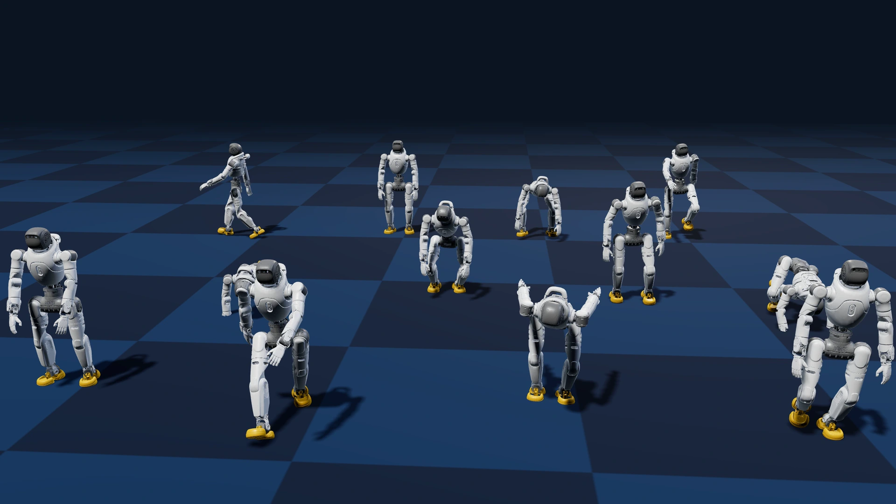
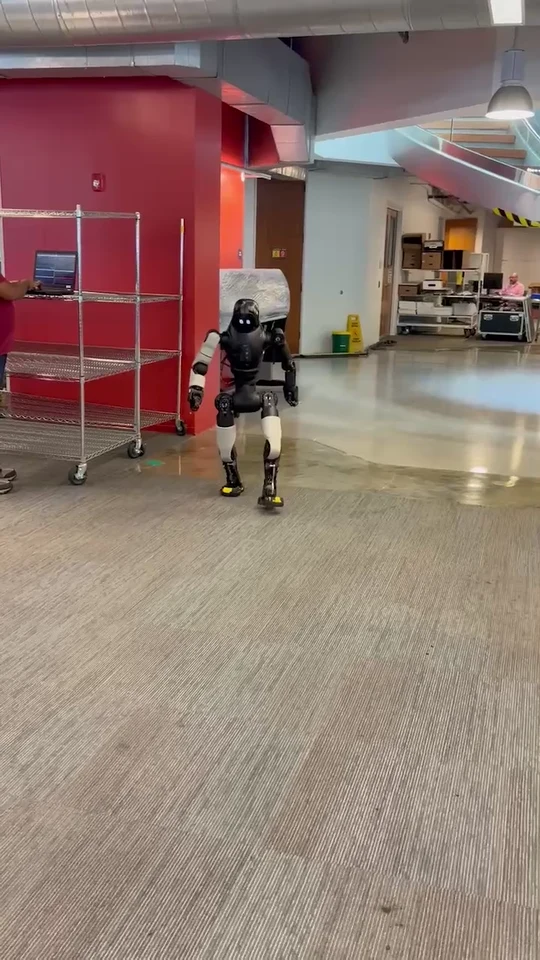
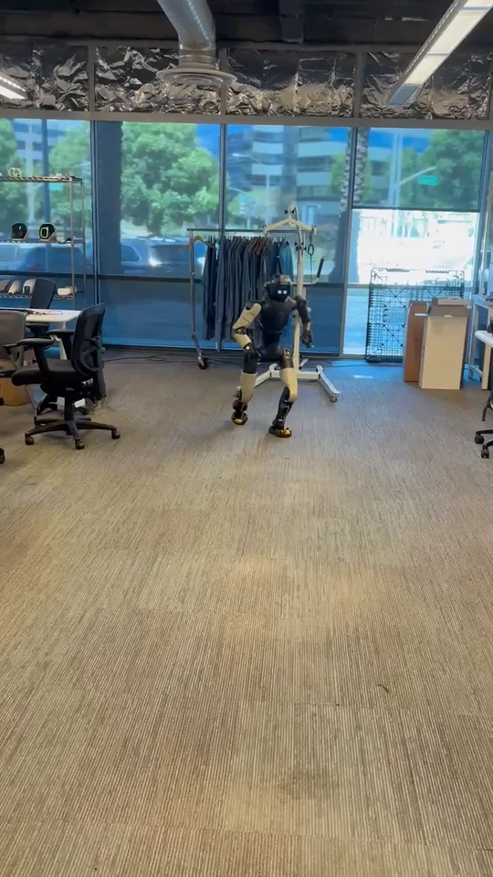

# FFAI-WBC

In-house whole-body control framework for FF robots, based on NVIDIA GR00T WBC / GEAR-SONIC with custom robot integrations and training/deployment modifications.

## Motion showcase

- [Unitree G1 → FF Master web viewer](https://zhiyangrobot.github.io/g1-ffmaster-retarget/)
- [Unitree G1 → FF Master retarget dataset](https://huggingface.co/datasets/zhiyangrobot/g1-ffmaster-retarget)

### WBC demos

<table>
  <tr>
    <td align="center"></td>
    <td align="center"></td>
    <td align="center"></td>
  </tr>
</table>

## Scope

> TBD — project scope, modules, and training/deployment notes will live here.

## Status

Private in-house repository under `ff-eai`.

## Acknowledgments

We would like to acknowledge the following projects and datasets that this work builds on:

- [NVlabs/GR00T-WholeBodyControl](https://github.com/NVlabs/GR00T-WholeBodyControl) — source codebase for whole-body control / GEAR-SONIC components used in this repo
- [NVIDIA/soma-retargeter](https://github.com/NVIDIA/soma-retargeter) — motion retargeting tooling used for Unitree G1 → FF Master conversion
- [ChingMu MotionDecode](https://chingmudata.github.io/MotionDecode/) — motion dataset / showcase that our retarget demos and multi-robot preview build on

## License

This codebase is licensed under Apache-2.0.

**This project is for non-commercial use only.** Commercial use is not permitted.

This project may download and install additional third-party open-source components. Review their license terms before use.
