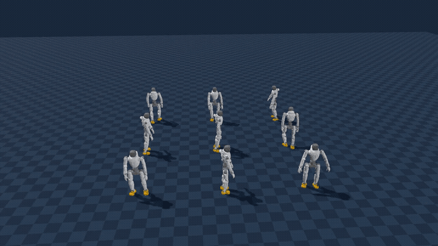

# FFAI-WBC

In-house whole-body control framework for FF robots, based on NVIDIA GR00T WBC / GEAR-SONIC with custom robot integrations and training/deployment modifications.

## Motion showcase

Nine FF Master robots playing different retargeted motions in one scene.

- Clip browser / side-by-side reviewer: [zhiyangrobot.github.io/g1-ffmaster-retarget](https://zhiyangrobot.github.io/g1-ffmaster-retarget/)
- CSV + bake dataset: [zhiyangrobot/g1-ffmaster-retarget](https://huggingface.co/datasets/zhiyangrobot/g1-ffmaster-retarget)

## Scope

> TBD — project scope, modules, and training/deployment notes will live here.

## Status

Private in-house repository under `ff-eai`.
